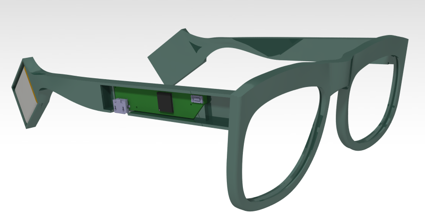
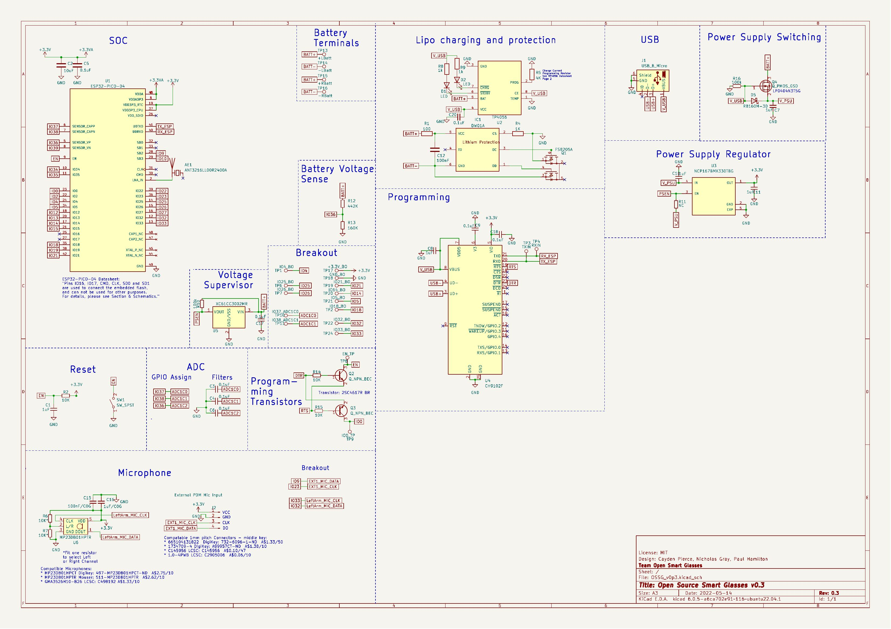
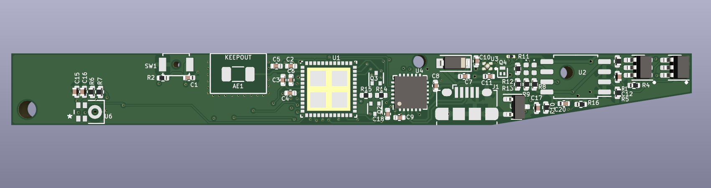
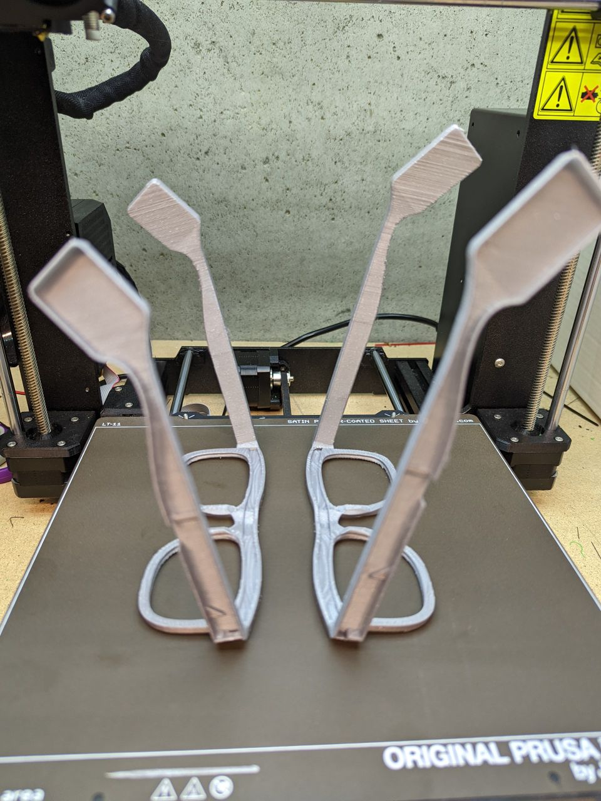
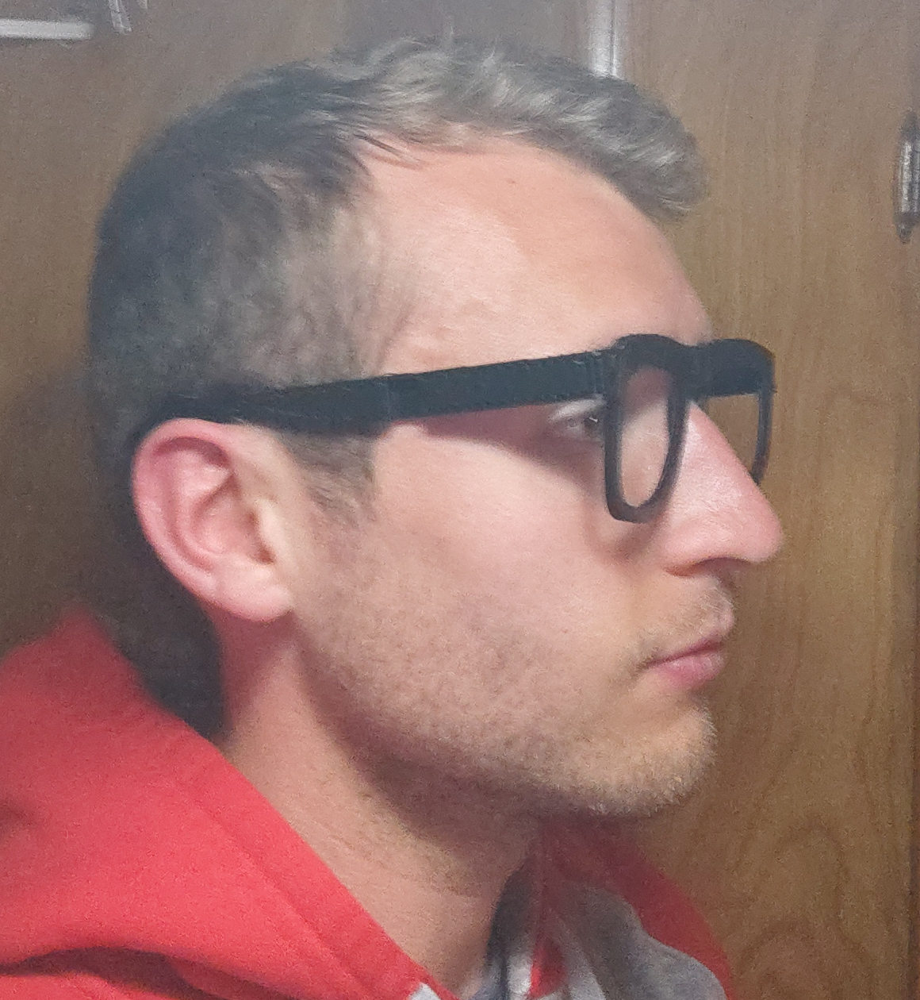

# Open Source Smart Glasses

A community of engineers, researchers, makers, designers, entrepreneurs, and anyone else driven to build technology that enhances user's intelligence in daily life.  

We're building open source smart glasses designed to be:  
1. All day wearable 
2. Immediately useful 
3. Extendable for makers, startups, and everyone else.  

This repo holds mechanical, electrical, and software files for the open source smartglasses developed by Team Open Smart Glasses.

## Images

## License

All work contained here is licensed under the MIT License.

## Overview

An overview of the project vision and roadmap. More information to be added soon. Feel free to join [the discord](https://discord.gg/5ukNvkEAqT) if you have any questions.  

If you want to jump ahead to something more specific to what we're currently working on, go straight to: [v0.3 Project Doc](https://github.com/CaydenPierce/OpenSourceSmartGlasses/wiki/v0.3-Project-Doc)
### OSSG - Open Source Smart Glasses

1. All day wearability. There is a difference between something that you could wear and something that you will wear. We are laser focused on building a form factor that users (us) will enjoy wearing from the start in terms of comfort, shape, size, weight, and aesthetics.
2. Immediately useful. There is a difference between will wear and want to wear. From the beginning, we are designing and building hardware with use cases in mind.
3. Extendable for makers, startups, researchers, and everyone else. Our Open Source approach is aimed at helping everyone use smart glasses. We believe the most valuable use cases will only arise when smart glasses are accessable to be built, worn, and hacked, so that's what we're making.

#### Plan

1. We want full fledged smart glasses with all-day wearability, display, camera, microphone, sensor suite, batteries, wireless communications, speakers, etc. that is low power, low heat, low profile (stylish), and provides a host of novel and valuable use cases, that is as open and extendable as possible.
2. Trying to do that all at once is too big of a task. Faster, better progress is made if one starts with something that works and then focuses on quick iterationn cycles for building something useful that we can wear all day, everday. We start with something all day wearable, and then we iterate from there. 
3. Instead of just focusing on hardware and hoping that the use case presents itself, our design starts from the use cases that we want, and we design from there. 
4. Build the first version of our glasses that meets the use case but stays technically simpler so we can never stray from our core value of all day wearability.
5. Once this early version is working and we all wear it all day, move on to more complicated things - like an applications processor and display.

## Team Open Smartglasses

Team Open Smartglasses is a group of engineers, researchers, makers, and designers from around the world joining forces to build Open Source Smartglasses. We aren't a business - we're a highly technical team of people who have all built custom wearables on our own in the past, coming together to build the world's best smart glasses, Open Source.

## Community

If you're interested in developing Open Source Smart Glasses, feel free to to join the [Discord server](https://discord.gg/5ukNvkEAqT) or reach out to [Cayden directly](https://caydenpierce.com).

## Contributors / Collaborators

The system is fully Open Source and built by this growing list of contributors:

- [Cayden Pierce](https://caydenpierce.com) - [Emex Labs](https://emexwearables.com)
- [Adrian Papineau](https://www.parallelinnov.com/about-us/)
- [Nicholas Gray](https://github.com/Thecactusman0)
- Paul Hamilton
- [MattTheMaker](https://www.mrdcreations.org/)
- Alyx
- Your Name Here, [join us](https://discord.gg/5ukNvkEAqT)!

## How Do I Buy A Pair?

We reccomend building your own. If you still want to buy a pair, reach out to cayden on the [Team Open Smart Glasses Discord Server](https://discord.gg/5ukNvkEAqT)
## Website

Website coming soon - https://smartglasses.community
